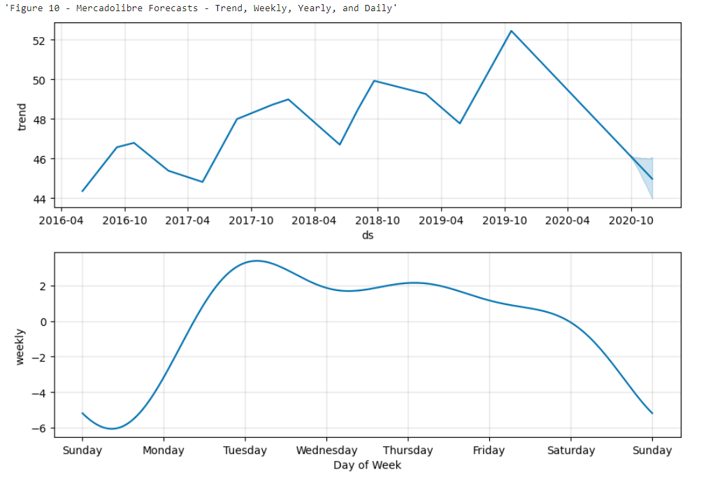

# Summary Report - Mercadolibre, Inc.   

## 1. Unusual Patterns in Hourly Google Search Traffic
Analysis was done on using Google search traffic over the the month that MercadoLibre released its financial results. There appears to have been an increase of 8.55% (Δ=3,008) in volume during May 2020 (∑=38,181) when compared to the median of all months (∑=35,172).


## 2. Seasonality in Search Traffic Data
### Hourly / Daily Trends
Figure 3 suggests there is hardly any activity between 6am and 11am. There is a gradual increase in activity from midday onwards to late evening, at which point the highest concentration of activity can be observed between 10pm and 2am. Activity declines fairly rapidly from 3am onwards.


### Seasonal Trends
Mercadolibre's search traffic is at its highest between weeks 21 and weeks 36, coinciding with the northern hemisphere's summer. From week 38 there is a significant drop in total volume. The search traffic tends to *DECREASE* during the (northern hemisphere's) winter holiday period (weeks 40 through 52).


## 3. Correlation of Search Traffic to Stock Price Patterns
The stock price dropped steadily by an eventual 50% within the period from late February to early April 2020, during which time search trends initially bucked the trend. Then came a sudden drop in search trends which fluctuated at close to low points for another month, during which time the share price gradually increased. A dramatic spike in searches in May 2020 coincided with an almost 20% jump in share price. After the dramatic spike search trends dropped by 25% approximately however the share price continued to increase. 

The trend appears to be consistent with the Market events that emerged during the year of 2020, which saw many companies struggling for business, but later recovered after the initial market shock with new customers and revenue increases.


Table 1 presents a weak negative correlation between the lagged search traffic and the stock volatility. Whereas, there is a weak positive correlation between lagged search traffic and the stock price returns.


## 4. Forecasting Future Sales
### Future Trends
The near-term forecast depicted in Figure 8 suggests based on the trend line that the popularity and searches are likely to decline.


### Popular time of day
Midnight appears to be the most popular time for activity, based on Figure 10 Daily plot.

### Typical day with highest search traffic
Tuesdays appear to be the day of week that gets the most search traffic, based on Figure 10 Weekly plot.

### Lowest point for search traffic in the calendar year
The lowest point for search traffic in the calendar year appears to be around mid October, based on Figure 10 Yearly plot. 




## 5. Forecast Revenue
Based on Prophet forecasts using past sales data to predict future outcomes, the total sales predictions for the next quarter are:   
```
  Expected total sales:  (USD)   969.63M 
  Best case total sales: (USD) 1,052.14M 
  Worst case scenario:   (USD)   887.57M
```